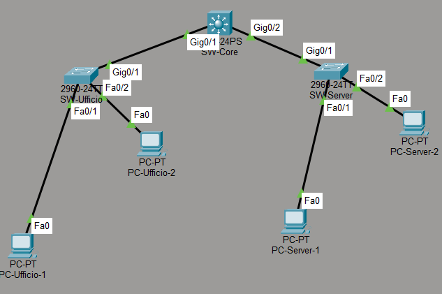

# Inter-VLAN Routing con SVI - Switch Layer 3

## Obiettivo
Implementare il routing inter-VLAN usando le SVI (Switched Virtual Interface)
su uno switch Layer 3, eliminando la necessita di un router esterno.

## Differenza rispetto a Router-on-a-Stick

| | Router-on-a-Stick | Switch L3 con SVI |
|---|---|---|
| Hardware | Router + Switch | Solo Switch L3 |
| Scalabilita | Limitata | Molto migliore |
| Uso reale | Reti piccole | Reti enterprise |

## Topologia
- 1 Switch Layer 3 (SW-Core-L3) con ip routing abilitato
- 1 Switch Layer 2 Ufficio (SW-Ufficio) - VLAN 10
- 1 Switch Layer 2 Server (SW-Server) - VLAN 20
- 4 PC (2 per VLAN)

## Schema IP

| Dispositivo     | IP             | VLAN |
|-----------------|----------------|------|
| PC-Ufficio-1    | 192.168.10.2   | 10   |
| PC-Ufficio-2    | 192.168.10.3   | 10   |
| PC-Server-1     | 192.168.20.2   | 20   |
| PC-Server-2     | 192.168.20.3   | 20   |
| SVI VLAN 10     | 192.168.10.1   | 10   |
| SVI VLAN 20     | 192.168.20.1   | 20   |

## Cos'e una SVI?
Una SVI e un'interfaccia virtuale creata su uno switch Layer 3.
Funziona da gateway per la VLAN corrispondente — esattamente come
le sottointerfacce del router nel progetto Router-on-a-Stick, ma
tutto avviene internamente allo switch senza hardware aggiuntivo.

## Comandi chiave

Abilitare il routing sullo switch L3:
ip routing

Creare una SVI:
interface vlan 10
ip address 192.168.10.1 255.255.255.0
no shutdown

## Strumenti
- Cisco Packet Tracer
- Switch Layer 3 Cisco 3560
- Protocollo 802.1Q (trunk)
- Inter-VLAN routing con SVI